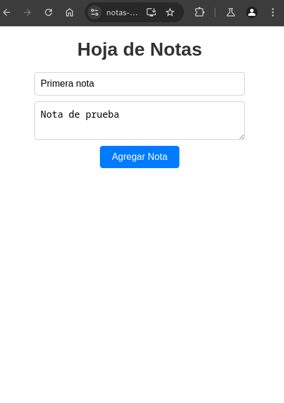
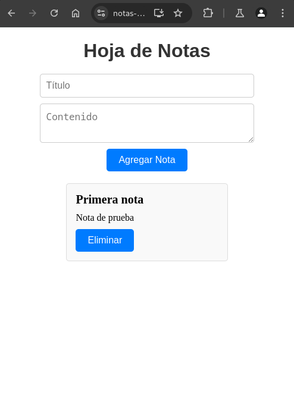

# Notas PWA

Notas PWA is a Progressive Web Application built with Angular and Firebase. This application allows users to create and delete notes, providing a seamless experience across different devices.

## Features

- Create and delete notes
- Offline support
- Responsive design
- Real-time synchronization with Firebase

## Technologies Used

- Angular
- Firebase (Firestore, Authentication, Hosting)
- Angular Service Worker

## Getting Started

### Prerequisites

- Node.js and npm installed
- Angular CLI installed
- Firebase account

### Installation

1. Clone the repository:
    ```bash
    git clone https://github.com/lytsistemas/notas-pwa.git
    cd notas-pwa
    ```

2. Install dependencies:
    ```bash
    npm install
    ```

3. Set up Firebase:
    - Create a new Firebase project in the [Firebase Console](https://console.firebase.google.com/).
    - Add your Firebase configuration to `src/environments/environment.ts` and `src/environments/environment.prod.ts`.

4. Serve the application:
    ```bash
    ng serve
    ```

5. Build the application for production:
    ```bash
    ng build --prod
    ```

6. Deploy to Firebase Hosting:
    ```bash
    firebase deploy
    ```

## Screenshots




## License

This project is licensed under the MIT License. See the [LICENSE](./LICENSE) file for details.